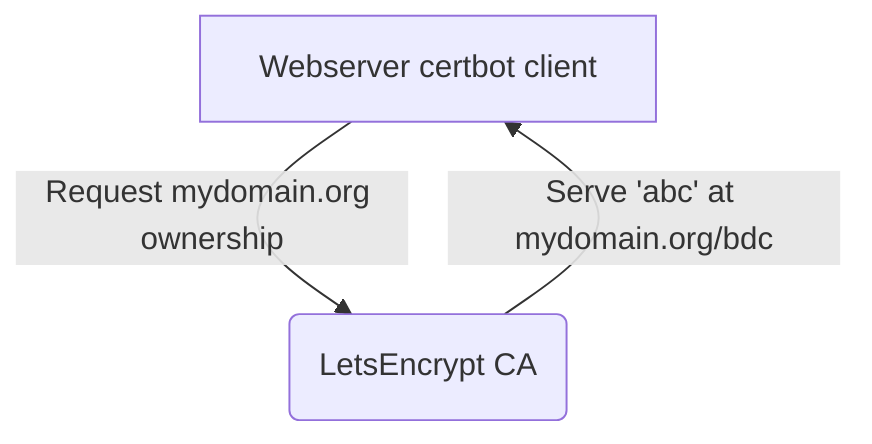
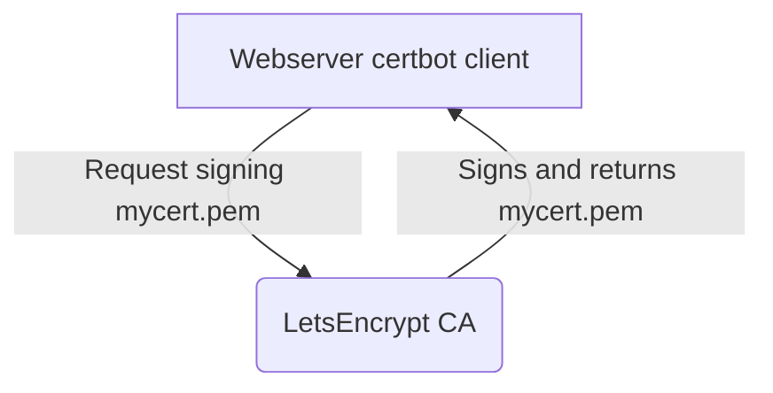
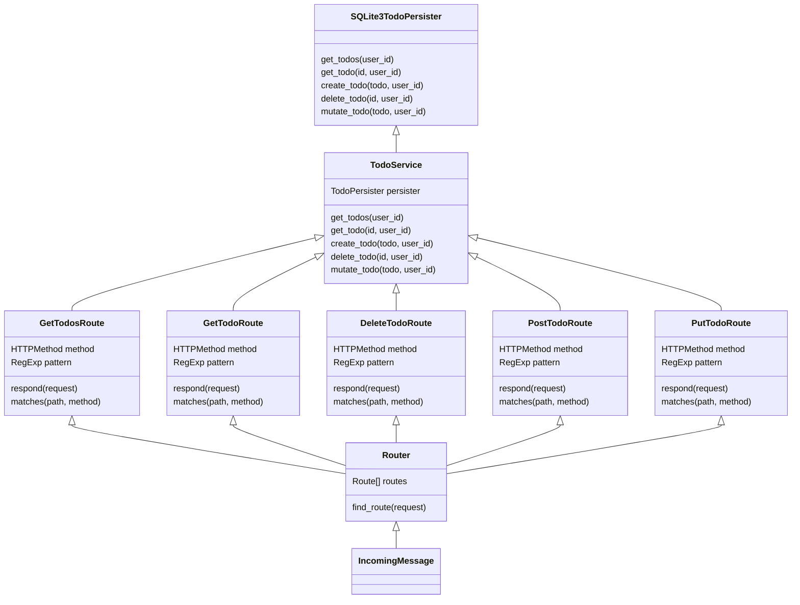
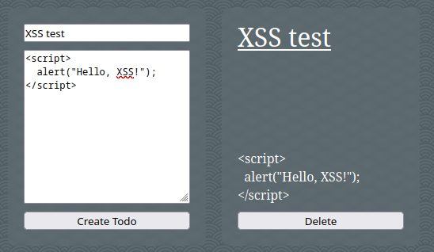

---
# try also 'default' to start simple
theme: purplin
background: https://source.unsplash.com/collection/94734566/1920x1080
class: 'text-center'
highlighter: shiki
lineNumbers: true
info: ''
drawings:
  persist: false
css: unocss
---

# Cryptography

Native NodeJS HTTP, bcrypt & sqlite3


<!--
The last comment block of each slide will be treated as slide notes. It will be visible and editable in Presenter Mode along with the slide. [Read more in the docs](https://sli.dev/guide/syntax.html#notes)
-->

---

# Architecture choices

- **Common**
    - **TypeScript** JavaScript superset
    - **GNU Make** Build system
- **Server**
    - **Native NodeJS HTTP** Webserver
    - **Bcrypt** Cryptography module
    - **SQLite3** Database & driver
    - **Docker** Deployment platform
    - **Traefik** Edge router
    - **Letsencrypt** Certificate authority
- **Client**
    - **Vite** Bundler
    - **SASS** CSS superset

<!--
You can have `style` tag in markdown to override the style for the current page.
Learn more: https://sli.dev/guide/syntax#embedded-styles
-->

---

# Hashing

Bcrypt salt-less password adapter

```ts {all|11-15|7-9}
import { EmptyHashError } from "./error/empty_hash";
import * as bcrypt from "bcrypt";

export class Password {
    ...

    public async validate(input_hash: string): Promise<boolean> {
        return await bcrypt.compare(input_hash, this.hash);
    }

    public static async from_string(password_string: string): Promise<Password> {
        const salt = await bcrypt.genSalt(10);
        const hash = await bcrypt.hash(password_string, salt);
        return new Password(hash);
    }
}
```

---

# Hashing

No salt lookup password validation

```ts {all|3|11-18}
return new Promise(async (resolve, reject) => {
    const db = await this.get_db();
    db.get("select password from account where email = ?;", [payload.email], async (error: Error | null, account: { password: string } | undefined) => {
        if (error !== null) {
            return reject(error)
        }
        if (account === undefined) {
            return reject(new HTTPUnauthorizedError());
        }

        const authenticated = await new Password(account.password).validate(payload.password)
        //                                       |                          |--> 'password'
        //                                       |--> '$2a$12$3Kw1Ujxdc/2kRr4hmMBJ/MbmeWn9ezXk3dLOKej43ew/ui'
        if (authenticated) {
            resolve(payload.email);
        } else {
            resolve(undefined);
        }
    });
});
```

---

# HTTPS TLS certificate

Traefik routing with `docker-compose` configuration file labels.

```yaml {all|13|14-16}
version: "3.7"

services:
  tec_nodejs_crud:
    image: kruhlmann/tec-nodejs-crud:latest
    container_name: tec-nodejs-crud
    restart: unless-stopped
    environment:
      - DB_PATH=/usr/app/todos.db
      - SERVER_PORT=3000
    labels:
      - "traefik.enable=true"
      - "traefik.http.routers.tec_nodejs_crud.rule=Host(`nodejs-crud.tec.kruhlmann.dev`)"
      - "traefik.http.routers.tec_nodejs_crud.tls=true"
      - "traefik.http.routers.tec_nodejs_crud.tls.certresolver=letsencrypt"
      - "traefik.http.routers.tec_nodejs_crud.entrypoints=https"
      - "traefik.http.routers.tec_nodejs_crud.priority=1"
      - "traefik.docker.network=web"
      - "com.centurylinklabs.watchtower.enable=true"
      - "traefik.http.services.tec_nodejs_crud.loadbalancer.server.port=3000"
```

---

# LetsEncrypt CA

*Simplified*

<div style="display: flex; justify-content: center">

</div>

On DNS challenge completion

<div style="display: flex; justify-content: center">

</div>

---

# Routing

<div style="display: flex; justify-content: center">

</div>

---

# XSS Protection

No raw HTML manipulation & opaque cookie

<div class="grid gap-4">
<div class="d2">

</div>
<div>
```ts {all|5,7}
const wrapper_element = this.root.createElement("div");

...

const title_text = this.root.createTextNode(todo.title);
title_element.appendChild(title_text);
const description_text = this.root.createTextNode(todo.description);
description_element.appendChild(description_text);

...

wrapper_element.appendChild(title_element);
wrapper_element.appendChild(description_element);
wrapper_element.onclick = this.event_factory.create_todo_onclick(todo, wrapper_element);
return wrapper_element;
```
</div>
<div>
```ts
Session.get().add(email)
const session_id = Session.get().user_to_session(email);
headers["Set-Cookie"] = `cid=${session_id}; Path=/`;
```
</div>
</div>

<style>
    .grid {
        grid-template-columns: 40% 60%;
        align-items: center;
    }

    .d2 {
        grid-row: span 2;
    }
</style>

---
class: 'text-center'
---

# Demo

<a href="https://nodejs-crud.tec.kruhlmann.dev">Public domain</a>
